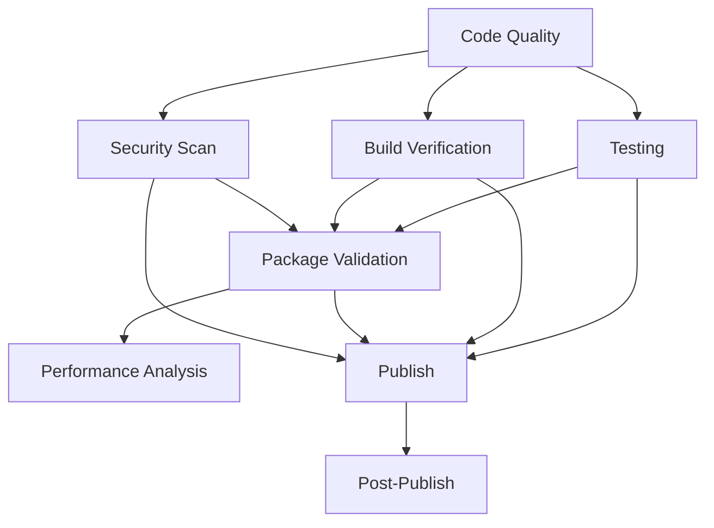

# Workflow Guide - Understanding the CI/CD Pipeline

Este guia explica cada job do workflow customizado e como monitorar o processo.

## 🎯 Visão Geral do Pipeline



## 📋 Jobs Detalhados

### 1. 🔍 Code Quality & Static Analysis

**Propósito**: Garantir qualidade do código
**Duração**: ~3-5 minutos
**Triggers**: Push, PR, Tags

**Verificações:**
- ✅ Formatação Dart (`dart format`)
- ✅ Análise estática rigorosa (`dart analyze --fatal-infos`)
- ✅ Validação do pubspec.yaml
- ✅ Auditoria de dependências
- ✅ Verificação de estrutura

**Quando falha:**
- Código mal formatado
- Warnings ou erros de análise
- pubspec.yaml inválido
- Dependências vulneráveis

### 2. 🧪 Unit & Integration Tests

**Propósito**: Validar funcionalidade
**Duração**: ~5-8 minutos
**Dependências**: Code Quality

**Verificações:**
- ✅ Execução de todos os testes
- ✅ Coverage mínimo de 80%
- ✅ Upload para Codecov
- ✅ Validação do exemplo

**Quando falha:**
- Testes falhando
- Coverage abaixo de 80%
- Problemas no exemplo

### 3. 🏗️ Build Verification (Matrix)

**Propósito**: Garantir compatibilidade multiplataforma
**Duração**: ~8-15 minutos por plataforma
**Dependências**: Code Quality
**Plataformas**: Web, Android, Linux

**Verificações:**
- ✅ Build bem-sucedido para cada plataforma
- ✅ Artefatos gerados corretamente
- ✅ Dependências específicas da plataforma

**Quando falha:**
- Problemas de compatibilidade
- Dependências faltantes
- Erros de build específicos

### 4. 📦 Package Validation

**Propósito**: Validar estrutura e conformidade
**Duração**: ~3-5 minutos
**Dependências**: Code Quality, Testing

**Verificações:**
- ✅ Estrutura de arquivos obrigatórios
- ✅ Documentação válida
- ✅ Dry-run publish
- ✅ Critérios de pontuação do pub.dev
- ✅ Verificação de arquivos sensíveis

**Quando falha:**
- Arquivos obrigatórios faltando
- Documentação inválida
- Problemas na estrutura do package

### 5. 🔒 Security Vulnerability Scan

**Propósito**: Garantir segurança
**Duração**: ~2-3 minutos
**Dependências**: Code Quality

**Verificações:**
- ✅ Auditoria de vulnerabilidades (`dart pub audit`)
- ✅ Detecção de secrets hardcoded
- ✅ Verificação de padrões de segurança

**Quando falha:**
- Vulnerabilidades encontradas
- Secrets hardcoded detectados
- Dependências inseguras

### 6. 📊 Performance & Size Analysis

**Propósito**: Otimização e monitoramento
**Duração**: ~3-5 minutos
**Dependências**: Build Verification

**Verificações:**
- ✅ Análise de tamanho do bundle
- ✅ Árvore de dependências
- ✅ Métricas de performance

**Quando falha:**
- Raramente falha, mais para monitoramento

### 7. 🚀 Automated Publishing

**Propósito**: Publicar no pub.dev
**Duração**: ~2-4 minutos
**Trigger**: Apenas tags `v*`
**Dependências**: Testing, Build Verification, Package Validation, Security Scan

**Verificações:**
- ✅ Autenticação OIDC
- ✅ Versão tag vs pubspec.yaml
- ✅ Entry no CHANGELOG.md
- ✅ Publicação final

**Quando falha:**
- Versões não coincidem
- CHANGELOG.md faltando
- Falha na autenticação OIDC
- Package já existe

### 8. 🎉 Post-Publish Actions

**Propósito**: Finalização e notificações
**Duração**: ~1-2 minutos
**Dependências**: Publish

**Ações:**
- ✅ Criação de GitHub Release
- ✅ Notificações de sucesso
- ✅ Links para o package

## 🎛️ Monitoramento

### Acompanhar Execução

1. **GitHub Actions Tab**: `https://github.com/username/repo/actions`
2. **Workflow runs**: Clique na execução específica
3. **Job details**: Clique em cada job para ver logs

### Logs Importantes

**Code Quality:**
```
✅ Code formatting is correct
✅ Static analysis passed
✅ pubspec.yaml validation passed
```

**Testing:**
```
✅ Unit tests completed
Test coverage: 85.2%
✅ Coverage meets minimum requirements
```

**Build Verification:**
```
✅ Build for web completed successfully
✅ Web build artifacts verified
```

**Publishing:**
```
✅ Version verification passed
✅ CHANGELOG.md entry verified
✅ Package published successfully!
```

## 🔧 Customização

### Ajustar Coverage Threshold

No job `testing`, modifique:
```yaml
MINIMUM_COVERAGE=80  # Altere para o valor desejado
```

### Adicionar Plataformas

No job `build-verification`, adicione na matrix:
```yaml
matrix:
  platform: [web, android, linux, ios, macos, windows]
```

### Modificar Verificações de Segurança

No job `security-scan`, ajuste os padrões:
```yaml
SECRET_PATTERNS=("seu_padrao_aqui")
```

## 🚨 Troubleshooting

### Job Falhou - Como Debugar

1. **Clique no job falhado**
2. **Expanda o step com erro**
3. **Leia a mensagem de erro**
4. **Corrija localmente e teste:**
   ```bash
   # Para code quality
   dart format .
   dart analyze --fatal-infos
   
   # Para tests
   flutter test --coverage
   
   # Para build
   cd example && flutter build web
   ```

### Problemas Comuns

**Coverage Baixo:**
```bash
# Ver relatório local
flutter test --coverage
genhtml coverage/lcov.info -o coverage/html
open coverage/html/index.html
```

**Build Falha:**
```bash
# Testar localmente
cd example
flutter clean
flutter pub get
flutter build web --verbose
```

**Publish Falha:**
```bash
# Dry run local
dart pub publish --dry-run
```

## 📈 Otimizações

### Cache Optimization

O workflow usa cache para:
- Flutter SDK
- Pub dependencies
- Build artifacts

### Parallel Execution

Jobs independentes rodam em paralelo:
- Code Quality ↔ Security Scan
- Testing ↔ Build Verification

### Conditional Execution

- **Publish**: Apenas em tags
- **Codecov**: Apenas se configurado
- **Release**: Apenas após publish

## 🎯 Benefícios

1. **🔒 Segurança**: Múltiplas camadas de verificação
2. **🚀 Velocidade**: Jobs paralelos, cache otimizado
3. **📊 Visibilidade**: Logs detalhados de cada etapa
4. **🔄 Confiabilidade**: Validação em múltiplas plataformas
5. **📦 Qualidade**: Padrões rigorosos antes da publicação
6. **🎉 Automação**: Do commit à publicação, tudo automatizado